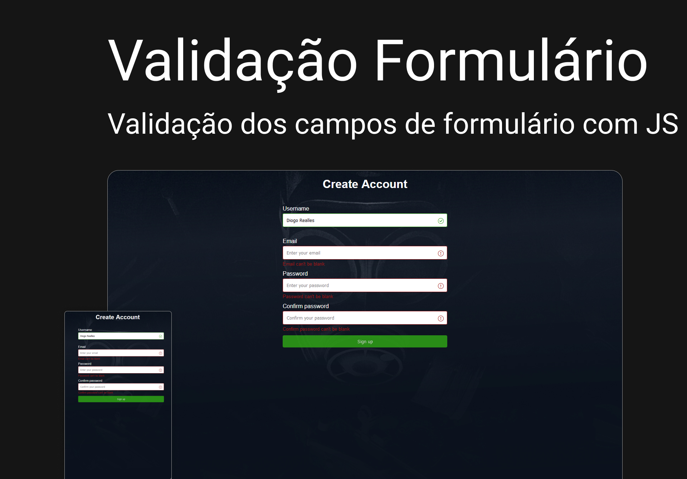

<div align="center">

  # Formulário com Validação
  
  <p>Formulário simples com validação dos campos.</p>

   &nbsp;
   &nbsp;
   &nbsp;
   &nbsp;

  
</div>

<div>

  # ⚡ Overview
  <b>Formulário simples com validação dos campos.</b>
   
  ## Features:
  - Manipulação de DOM
  - Totalmente responsivo
  - SEO otimizado
  - W3C validação
  - Acessibilidade

  # 📚 Aprendizados
  O objetivo desse desafio é de aprimorar minhas skills de front-end e JavaScript. <br />
  Aplicando princípios básicos de um formulário, como campos inputs, labels, acessibilidade estilos e validação simples utilizando a linguagem de estudo JavaScript. <br />
  Ampliar meu repertório de projetos.
  Documentar o processo para futuras referências.
  <br /><br />
  
  # 🚀 Deploy
  [Ver online](https://form-validade-js-01.softwarealles.repl.co/)

  ## Clone

  ```
  git clone git@github.com:DiogoRealles/form-validate.git
  ```
</div>


<footer>
  <p>Gostou? deixa seu like!</p>
  <p>Estou disponível para realizar seus projetos</p>
  <a href="mailto:diogorealles@hotmail.com"></a>
  <a href="https://www.linkedin.com/in/diogorealles/"></a>
  
  <p><strong>Diogo Realles | 2024</strong></p>
</footer>
